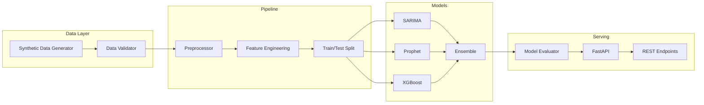

# Finance Forecasting ML

[](https://github.com/harikabotcha/finance-forecasting-ml/actions/workflows/tests.yml)
[](https://github.com/harikabotcha/finance-forecasting-ml/actions/workflows/lint.yml)
[](https://www.python.org/downloads/)

A **production-ready revenue forecasting system** built with Python, featuring a complete data pipeline, three ML models (ARIMA, Prophet, XGBoost), an ensemble combiner, and a FastAPI REST API — all containerized with Docker and automated via GitHub Actions CI/CD.

## Architecture



## Features

- **End-to-end data pipeline** — ingestion, validation, preprocessing, and feature engineering
- **Three forecasting models** — SARIMA, Prophet, and XGBoost with automatic comparison
- **Weighted ensemble** — combines model predictions using inverse-RMSE weighting
- **Feature engineering** — lag features, rolling statistics, calendar indicators, YoY changes
- **FastAPI REST API** — predict, list models, health checks with auto-generated docs
- **Docker + Compose** — one-command deployment with PostgreSQL
- **CI/CD** — GitHub Actions for testing, linting, and Docker builds
- **Comprehensive tests** — pytest with coverage reporting

## Quick Start

### Option 1: Local Development

```bash
# Clone the repository
git clone https://github.com/harikabotcha/finance-forecasting-ml.git
cd finance-forecasting-ml

# Install dependencies
pip install -r requirements.txt

# Run the full pipeline (generate data → train models → evaluate)
python -m scripts.run_pipeline

# Start the API server
make run
```

### Option 2: Docker

```bash
docker-compose up --build
```

Visit **http://localhost:8000/docs** for the interactive API documentation.

## Project Structure

```
src/forecast/
├── config.py                    # Pydantic settings management
├── logger.py                    # Structured logging
├── data/
│   ├── generator.py             # Synthetic revenue data with trends + seasonality
│   ├── validator.py             # Data quality checks
│   ├── loader.py                # CSV/DB loading with filtering
│   └── schemas.py               # Pydantic data models
├── pipeline/
│   ├── preprocessor.py          # Cleaning, normalization, outlier capping
│   ├── feature_engineering.py   # Lags, rolling stats, calendar features
│   ├── data_splitter.py         # Time-based train/test split
│   └── orchestrator.py          # End-to-end pipeline coordinator
├── models/
│   ├── base.py                  # Abstract forecaster interface
│   ├── arima_model.py           # SARIMA implementation
│   ├── prophet_model.py         # Facebook Prophet
│   ├── xgboost_model.py         # XGBoost with recursive prediction
│   ├── ensemble.py              # Inverse-RMSE weighted ensemble
│   ├── trainer.py               # Multi-model training orchestration
│   └── evaluator.py             # RMSE, MAE, MAPE, directional accuracy
├── api/
│   ├── main.py                  # FastAPI application
│   ├── routes/                  # Health, forecast, model endpoints
│   ├── schemas.py               # Request/response models
│   └── middleware.py            # Request logging + timing
└── utils/
    ├── metrics.py               # Evaluation metric functions
    └── visualization.py         # Forecast comparison plots
```

## API Endpoints

| Method | Endpoint | Description |
|--------|----------|-------------|
| `GET` | `/health` | Health check |
| `GET` | `/api/v1/models` | List all models and training status |
| `POST` | `/api/v1/forecast/predict` | Generate forecasts for a product |

### Example: Generate Forecast

```bash
curl -X POST http://localhost:8000/api/v1/forecast/predict \
  -H "Content-Type: application/json" \
  -d '{"product_id": "PROD_A", "horizon": 30}'
```

## Development

```bash
# Install dev dependencies
pip install -r requirements-dev.txt

# Run tests
make test

# Lint checks
make lint

# Auto-format code
make format

# Generate data only
make data-generate

# Train models only
make train
```

## Tech Stack

| Component | Technology |
|-----------|-----------|
| Language | Python 3.11 |
| Data Processing | pandas, NumPy |
| Time Series | statsmodels (SARIMA), Prophet |
| ML | XGBoost, scikit-learn |
| API | FastAPI, Uvicorn |
| Database | PostgreSQL |
| Containerization | Docker, docker-compose |
| CI/CD | GitHub Actions |
| Testing | pytest, pytest-cov |
| Code Quality | Black, isort, mypy |

## License

MIT
